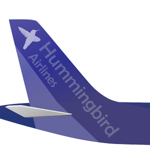

# hummingbird.airlines.svc

Middle-ware and Back-end Services used in the hummingbird airlines application. 
The web service is deployed at https://hummingbirdalm.azurewebsites.net/airlines

## License
This service/application is used to demonstrate the different functionalities of a Soap Web Service, including inheritance. You can use this service to learn WSDL, SOAP and work with Atmosphere Studio (see: https://www.stellar-qa.com/).
The Web Service is hosted on a free infrastructure which does not support heavy load. It is forbidden to use deployed service as target of heavy load calls.

## Backend services
### International Flight Reservation service
Endpoint: https://hummingbirdalm.azurewebsites.net/airlines/BookingSystemService.svc
This service simulates the flight reservation system that manages the ticket reservations for all airlines

### Flight Information
Endpoint: https://hummingbirdalm.azurewebsites.net/airlines/FlightManagementService.svc
This service simulates the flight control system used by the Airport

### Luggage Registration
This service simulates the Luggage registration system used by the Airport
Endpoint: https://hummingbirdalm.azurewebsites.net/airlines/LuggageManagementService.svc

## Middle-ware
This is an enterprise application integration (EAI) platform that interfaces with front-end application to different back-end applications
Endpoint: https://hummingbirdalm.azurewebsites.net/airlines/EAIService.svc

## Disclaimer
Hummingbird Airlines is a fiction airliner used for Hummingbird Application demonstration. The name is chosen because as of June 2018, There is no such airliners.
We do not acknowledge the intended attack for trademark violation if someone or some organization have registered "Hummingbird Airlines" as a trademark after June 2018.
